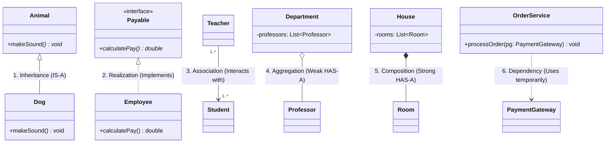

# Class Relationships

Class relationships describe how classes connect to one another in object-oriented design. The six core relationships are:

1. **Inheritance** - an `IS-A` relationship between a subclass and superclass.
2. **Realization** - a class fulfills an interface contract.
3. **Association** - classes are connected and interact with one another.
4. **Aggregation** - a weak `HAS-A` relationship where the part can outlive the whole.
5. **Composition** - a strong `HAS-A` relationship where the part depends on the whole.
6. **Dependency** - a temporary `USES` relationship, commonly through a method parameter or local variable.

## Class Relationship Diagram



## Relationship Comparison

| # | Relationship | OOP Concept | Lifecycle Coupling | UML Arrow / Line | Java Implementation Example |
|---|---|---|---|---|---|
| 1 | **Inheritance** | `IS-A` | Permanent / rigid | Solid line with hollow triangle `--▷` | `class Dog extends Animal` |
| 2 | **Realization** | `IMPLEMENTS` | Contract adherence | Dashed line with hollow triangle `..▷` | `class Employee implements Payable` |
| 3 | **Association** | `USE-A` / linked | Independent | Solid line with arrow `-->` | `class Teacher { Student[] students; }` |
| 4 | **Aggregation** | `HAS-A` (weak) | Independent; the part outlives the whole | Hollow diamond `o--` | `class Department { List<Professor> profs; }` |
| 5 | **Composition** | `HAS-A` (strong) | Dependent; the part dies with the whole | Filled diamond `*--` | `class House { List<Room> rooms = new ArrayList<>(); }` |
| 6 | **Dependency** | `USES-TEMPORARILY` | Transient; usually method scope | Dashed line with arrow `..>` | `void checkout(PaymentGateway pg)` |

## Java Relationship Examples

### Inheritance

A subclass inherits behavior and structure from a superclass. This models a permanent `IS-A` relationship.

```java
class Animal {
    void makeSound() {}
}

class Dog extends Animal {
    @Override
    void makeSound() {}
}
```

### Realization

A class realizes an interface by implementing its contract.

```java
interface Payable {
    double calculatePay();
}

class Employee implements Payable {
    @Override
    public double calculatePay() {
        return 0.0;
    }
}
```

### Association

An association represents a structural link between independent classes.

```java
class Teacher {
    private Student[] students;
}
```

### Aggregation

The whole receives parts from outside. The parts can exist independently of the whole.

```java
class Department {
    private final List<Professor> professors;

    Department(List<Professor> professors) {
        this.professors = professors;
    }
}
```

### Composition

The whole creates and owns its parts. The parts generally do not exist independently of the whole.

```java
class House {
    private final List<Room> rooms = new ArrayList<>();
}
```

### Dependency

A dependency is a temporary relationship, often represented by a method parameter.

```java
class OrderService {
    void processOrder(PaymentGateway paymentGateway) {
        // Use paymentGateway while processing the order.
    }
}
```

## Quick Distinction

- Use **inheritance** when the subtype genuinely is a specialized form of the parent type.
- Use **realization** when a class must satisfy an interface contract.
- Use **association** for a general long-lived link between independent objects.
- Use **aggregation** when the whole groups parts that can live independently.
- Use **composition** when the whole owns the lifecycle of its parts.
- Use **dependency** when a class only needs another class temporarily to complete an operation.
